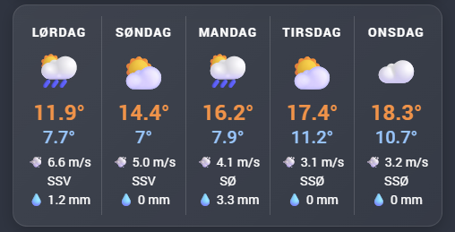
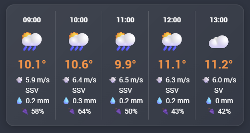
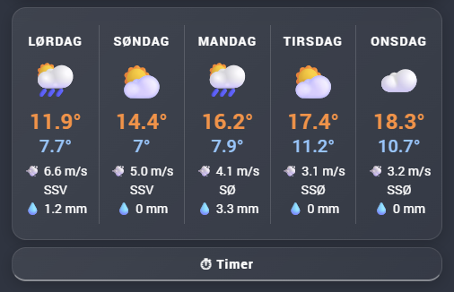

# 🌤️ MET.CO Weather Cards for Home Assistant
*A clean and visual way to display MET.CO forecast data inside Home Assistant*

This repository contains my custom setup for presenting weather data from the **MET.CO integration** in Home Assistant.  
It includes three cards that provide both short‑term and long‑term forecasts in a clear and visually appealing format.

---

## ✨ Features
- **5‑Day Forecast Card** – Overview of the next five days  
- **5‑Hour Forecast Card** – Hour‑by‑hour details for the next five hours  
- **Combined Forecast Card** – Switch between daily and hourly view in one card  

---

## 🖼️ Visual Examples

### 5‑Day Forecast  

### 5‑Hour Forecast  

### Combined Card  

---

## ⚙️ Requirements

To use these weather cards in Home Assistant, the following components must be installed:

# Integration
Met.no (built‑in weather provider used by MET.CO)

# Cards
- vertical-stack (core Lovelace card) &
- custom:button-card (HACS custom card)

# input_boolean

Navn: vejr_visning

---

## ⚡ Quick Start
Follow these steps to get the MET.NO weather cards running in your Home Assistant setup:

# Install the required integration

Enable the Met.no weather integration in Home Assistant.

# Install required cards

- Add vertical-stack (core Lovelace card)
- Install custom:button-card via HACS

# Create the REST sensors

- Add your MET.NO REST sensors in configuration.yaml or via the UI
- These sensors provide the raw forecast data used by the cards
- Make sure both daily and hourly endpoints are included

After adding the sensors, restart Home Assistant to activate them

# Create the template sensors

Build your template sensors based on the REST data
These sensors normalize the forecast into a clean structure for the cards

Restart is not required for template sensors created via UI, but recommended if added in YAML

# Add the cards to your dashboard

Insert the YAML for the

- 5‑Day Forecast Card
- 5‑Hour Forecast Card
- Combined Card

---

## 🧩 How It Works
All cards are powered by:

- The **MET.CO integration**  
- **Daily** and **hourly** forecast entities  
- A layout optimized for **Sections View**  
- A clean structure that highlights the most important weather details  

---

## 🚀 Purpose
This project demonstrates how MET.NO forecast data can be displayed in a **clear**, **functional**, and **dashboard‑friendly** way.  
Use it as inspiration or integrate it directly into your own Home Assistant setup.
